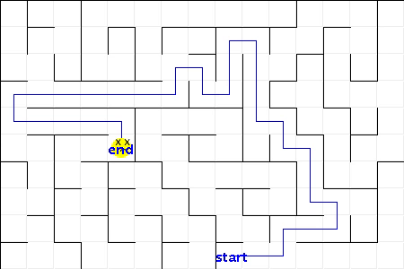

Maze Walker
===========
Introduction:
-------------

Maze walker is a Java program that generates a random maze with a random start and end and solves itself. The maze walker features sound effects and facials from the canvas class for fun. This program originally ran using multiple threads but was later changed to use a publisher and subscriber pattern that was more efficient. The grid and walker publish events for the canvas to process. The images are also first generated on a buffered image before being painted on the JPanel to avoid flickering images.

The maze maker picks a random maze cell from a grid of maze cells to start a path. The maze maker continues to pick adjacent, disconnected cells in random directions to build a path. After the first path comes to a dead end, the maze maker will look for a disconnected maze cell that is adjacent to the existing path and extend a new path. This process will be repeated until there are no more disconnected maze cells.

Once the maze maker is finished, the maze walker will begin solving the maze from the random starting point to the random end point, both determined by the maze maker. The maze walker uses a stack to keep track of its path, while keeping the already visited maze cells in a set. When the maze walker comes to a cell with multiple paths, it will try each path and backtrack upon a dead end until it reaches the end cell.

## Todos: 
* Improve maze walker intelligence
* Add user keyboard input to allow for people to solve the maze

Reuqirements:
-------------
* Java - 1.8 and up
* Maven - 3.6.3 and up

Build and Run:
--------------
```shell
mvn install

java -jar target/MazeMaker-*-jar-with-dependencies.jar
```

Sounds:
-------
For Windows or Linux users, modify effect sound files defined in the the SoundPlayer.Type enum.

Screenshots:
------------

